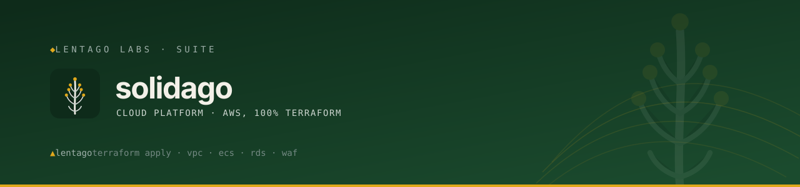

<!-- Lentago Labs brand header — generated by lentago/.github → brand/generate.py.
     Regenerate there; do not hand-edit the banner or badge URLs. -->
<a href="https://lentago.dev"></a>

[](https://github.com/lentago/solidago/actions) [](https://github.com/lentago/solidago/blob/main/LICENSE) [](https://deepwiki.com/lentago/solidago)

   

# solidago

> **Solidago** (goldenrod — from *solidare*, "to make whole") is the Lentago Labs codename for the Cloud Platform service. Renamed from `foundry-platform-demo` on 2026-07-03; AWS resource names were aligned to the `solidago` codename on 2026-07-07 (issue #102), and the shared Terraform state backend was migrated from `foundry-tfstate-*` to `solidago-tfstate-*` on 2026-07-08 (issue #103).

A Terraform-managed AWS environment built as a personal learning lab. It hosts a live application at [icecreamtofightwith.com](https://icecreamtofightwith.com).

**Authorship:** The Terraform, scripts, workflows, and documentation in this repo are co-written with [Claude](https://claude.ai) (Anthropic). I direct the architecture and review the output; Claude writes the code. I'm an infrastructure operator, not a software engineer — please don't read this repo as a portfolio of coding ability.

## 📚 Ask this codebase (DeepWiki)

<a href="https://deepwiki.com/lentago/solidago"></a>

> [DeepWiki](https://deepwiki.com/lentago/solidago) maintains an AI-generated wiki over this
> repository — architecture pages, diagrams, and a Q&A box grounded in the actual code. Every
> public Lentago Labs repo is indexed ([deepwiki.com/lentago](https://deepwiki.com/lentago));
> it is the fastest way to orient before reading source. It is AI-generated: trust it to orient
> you, verify against the code before you act on it.

**Good first questions:**

- How does the `terraform.yml` workflow's `gate` job avoid deadlocking required-status-check enforcement on docs-only PRs?
- What is the trust-policy difference between the `solidago-dev-github-actions` and `solidago-dev-github-actions-terraform` IAM roles, and which repos/environments can assume each?
- How would I onboard a brand-new containerized workload onto this platform's shared ECS cluster and ALB without touching the existing workloads?

## Why This Exists

I'm an infrastructure operations professional with 25+ years of production experience — bare-metal data centers, 24x7 ops, single-homed environments where every decision had physical consequences. This project is how I learn cloud-native architecture: by specifying what I want, having Claude implement it, and then operating it with real traffic.

The intent is to reflect how a production environment should be built, scaled down to a single-account learning lab. No shortcuts on security posture. No placeholder modules. Real CI/CD, real monitoring, real cost controls — but the *code* itself is Claude's, written under my direction.

## 🧭 What this repo demonstrates

Patterns an ops professional can lift into a day job — each one points at the code that proves it.

| Pattern | How it shows up here |
|---------|----------------------|
| **Plan-on-PR / apply-on-merge Terraform** — change management where the merged PR *is* the change record | [`.github/workflows/terraform.yml`](.github/workflows/terraform.yml): the `plan` job posts the full `terraform plan` diff as a PR comment; the `apply` job runs only on push to `main` / `workflow_dispatch`. Nobody runs `terraform apply` from a laptop. |
| **OIDC-only cloud auth** — no static AWS keys anywhere | `role-to-assume` in [`terraform.yml`](.github/workflows/terraform.yml) is scoped to `repo:lentago/solidago:environment:terraform`; there are no AWS access keys in GitHub Secrets. |
| **Dual IAM-role trust split** — blast-radius containment between infra and workloads | [`modules/iam`](modules/iam) + [`docs/WORKLOAD_RELATIONSHIP.md`](docs/WORKLOAD_RELATIONSHIP.md): `solidago-dev-github-actions` (workloads push to ECR/ECS) vs `solidago-dev-github-actions-terraform` (this repo mutates infra). Neither can do the other's job. |
| **Required check that survives path-filtered CI** — no docs-only PR gets stuck forever | The `gate` job in [`terraform.yml`](.github/workflows/terraform.yml) (`needs: [changes, plan]`, `if: always()`) reports green even when the plan is skipped, so the ruleset can require exactly `gate`. |
| **Shared reusable workflows** — cross-repo CI logic centralized, not copy-pasted | [`.github/workflows/docs-check.yml`](.github/workflows/docs-check.yml) is a thin wrapper over `uses: lentago/shared-workflows/.github/workflows/docs-check.yml@main`. |
| **Security-by-default posture** — even in a personal-scale lab | [`modules/waf`](modules/waf) (AWS managed rule groups + rate limiting), [`modules/security-groups`](modules/security-groups) (tiered least-privilege chaining), [`modules/kms`](modules/kms) (encryption at rest). |
| **Cost governance as code** — guardrails declared in Terraform, not clicked into the console | [`modules/budgets`](modules/budgets): `aws_budgets_budget` with SNS alerts at 50 / 80 / 100% thresholds. |
| **Known-benign diffs documented, not tolerated in silence** | [`modules/ecs/main.tf`](modules/ecs/main.tf) sets `ignore_changes = [task_definition, desired_count]` so CI/CD and auto-scaling own those fields; the recurring task-definition plan entry is expected AWS normalization, not drift. |

## 🛠️ Make a change yourself

This is a lab — the systems are real, the stakes are not. Pick a vector:

**Ship a new workload (module + Lambda) onto the shared platform.** Add or edit a module (for example [`modules/ask-lambda`](modules/ask-lambda)) and wire it into [`environments/dev/main.tf`](environments/dev/main.tf), then open a PR. The `changes` job detects the `.tf` edits, `plan` runs and posts the diff as a PR comment for review, and `gate` requires it green before merge. On merge to `main`, the `apply` job assumes the Terraform OIDC role and stands up the real AWS resources — no manual console step. This is the org-level showcase vector: a newcomer can trace one PR straight through to a live AWS effect.
**Proof this works:** [#119 — Add ask-lambda module + wire pondview 'Ask the Wiki' answer endpoint](https://github.com/lentago/solidago/pull/119); [#109 — Deploy the ALB-access-log → Axiom shipper as a Lambda](https://github.com/lentago/solidago/pull/109); [#117 — Add site_pondview: hidden preview for the Essex Crossing HOA wiki](https://github.com/lentago/solidago/pull/117).

**Onboard a second workload repo onto the shared ALB/ECS via OIDC trust.** Edit the IAM module's trust policy and the `apex-domain` module to add a new site plus Route 53 zone, open a PR reviewed through the posted Terraform plan, and merge. The `apply` provisions the new ECR/ECS/DNS/ACM stack and grants the new repo's OIDC subject deploy rights — the existing workloads' trust is left untouched. Adding a second repo's trust subject needs org-level access to that repo's Actions configuration.
**Proof this works:** [#135 — Bring pondviewlane.com online (apex domain, public launch)](https://github.com/lentago/solidago/pull/135); [#89 — Codify site-repo rename dual-trust in app OIDC role](https://github.com/lentago/solidago/pull/89).

**Rename/rebrand live AWS resources without breaking the running platform.** Rename resource identifiers in Terraform (`foundry-*` → `solidago-*`) in one PR reviewed via plan, merge, and let `apply` recreate or rename the named resources; a follow-up PR migrates the shared state backend key itself — proving the plan/apply loop handles even self-referential infra moves safely.
**Proof this works:** [#104 — Rename foundry-* AWS resource names to the solidago codename](https://github.com/lentago/solidago/pull/104); [#105 — Migrate shared Terraform state backend to solidago-tfstate-*](https://github.com/lentago/solidago/pull/105).

## What's Deployed

A three-tier web application running on AWS, fully managed by Terraform:

**Networking:** VPC with public, application, and data subnets across two AZs. NAT Gateways for private subnet egress. VPC Flow Logs for network visibility.

**Compute:** ECS Fargate running an Astro/Nginx application behind an Application Load Balancer with HTTPS (ACM certificate, Route 53 DNS). Auto-scaling on CPU and memory thresholds.

**Data:** RDS PostgreSQL and ElastiCache (Valkey) in private subnets. Secrets Manager for credential management.

**Security:** WAFv2 Web ACL on the ALB with AWS Managed Rules (Common Rule Set, Known Bad Inputs, IP Reputation List) and a custom rate-limiting rule. KMS customer-managed key for encryption at rest. Security groups with least-privilege chaining — each tier can only reach the tier it needs.

**Observability:** CloudWatch dashboard covering ECS, ALB, WAF, RDS, ElastiCache, and NAT Gateway metrics. CloudWatch alarms with SNS email notifications. CloudTrail for API audit logging. AWS Config for compliance rules.

**Cost Management:** AWS Budgets with SNS alerts at 50%, 80%, and 100% of a $100/month threshold.

**CI/CD:** This repo runs one Terraform pipeline; workload deploys run from their own repos.
- **Terraform** — plans on PR (with plan output posted as a PR comment), applies on merge to main. IAM role scoped to the `terraform` GitHub environment via OIDC sub-claim, so only this workflow can mutate infrastructure.
- **Workload deploys** — each workload builds and deploys from its own repository, assuming the platform-owned `solidago-dev-github-actions` IAM role via OIDC. The role's trust policy lists the workload repos ([site-icecreamtofightwith-com](https://github.com/lentago/site-icecreamtofightwith-com) plus the platform-hosted landing sites), so only those repos' workflows can push to ECR and update ECS.

## Architecture

```
┌─────────────────────────────────────────────────────────────┐
│  GitHub Actions                                             │
│  ┌──────────────┐  ┌──────────────┐                        │
│  │ App Deploy   │  │ Terraform    │                        │
│  │ (OIDC Role A)│  │ (OIDC Role B)│                        │
│  └──────┬───────┘  └──────┬───────┘                        │
└─────────┼─────────────────┼────────────────────────────────┘
          │                 │
          ▼                 ▼
┌─────────────────────────────────────────────────────────────┐
│  AWS Account (us-east-1)                                    │
│                                                             │
│  ┌─── WAF ──────────────────────────────────────────────┐   │
│  │                                                      │   │
│  │  ┌─── Public Subnets (2 AZs) ────────────────────┐  │   │
│  │  │  ALB (HTTPS) ──── Route 53 ──── ACM           │  │   │
│  │  │  Internet Gateway                              │  │   │
│  │  └────────────────────┬───────────────────────────┘  │   │
│  │                       │                              │   │
│  └───────────────────────┼──────────────────────────────┘   │
│                          │                                  │
│  ┌─── App Subnets (2 AZs) ──────────────────────────────┐  │
│  │  ECS Fargate (Astro/Nginx)                            │  │
│  │  NAT Gateways → Internet                              │  │
│  └────────────────────┬──────────────────────────────────┘  │
│                       │                                     │
│  ┌─── Data Subnets (2 AZs) ─────────────────────────────┐  │
│  │  RDS PostgreSQL    ElastiCache (Valkey)               │  │
│  │  Secrets Manager   KMS                                │  │
│  └───────────────────────────────────────────────────────┘  │
│                                                             │
│  ┌─── Observability ────────────────────────────────────┐   │
│  │  CloudWatch Dashboard + Alarms    CloudTrail          │  │
│  │  AWS Config Rules                 SNS Alerts          │  │
│  │  AWS Budgets                      VPC Flow Logs       │  │
│  └───────────────────────────────────────────────────────┘  │
└─────────────────────────────────────────────────────────────┘
```

## Repository Structure

```
solidago/
├── environments/
│   └── dev/
│       ├── main.tf              # Root module — wires all modules together
│       ├── variables.tf         # Environment-specific variables
│       ├── outputs.tf           # Exported values
│       └── terraform.tfvars     # Variable values for dev
├── modules/                     # 24 modules, all wired from environments/dev/main.tf
│   ├── alb/                     # Application Load Balancer + listeners + access-log bucket
│   ├── alb-log-shipper/         # Lambda shipping ALB access logs from S3 to Axiom
│   ├── apex-domain/             # Extra registered apex domain in front of a site (3 instances)
│   ├── ask-lambda/              # "Ask the Wiki" answer endpoint (Lambda + public function URL)
│   ├── aws-config/              # AWS Config recorder + compliance rules
│   ├── budgets/                 # AWS Budgets with SNS alerts
│   ├── cloudtrail/              # CloudTrail audit logging
│   ├── dashboard/               # CloudWatch operational dashboard
│   ├── dns/                     # Route 53 + ACM certificate
│   ├── ecr/                     # Container registry + lifecycle policy
│   ├── ecs/                     # ECS cluster, service, task definition
│   ├── ecs-autoscaling/         # Application Auto Scaling policies
│   ├── elasticache/             # ElastiCache (Valkey) replication group
│   ├── grafana-cloud/           # Cross-account read-only role for Grafana Cloud CloudWatch
│   ├── iam/                     # IAM roles, policies, OIDC provider
│   ├── kms/                     # KMS customer-managed key
│   ├── monitoring/              # CloudWatch alarms + SNS topic
│   ├── rds/                     # RDS PostgreSQL instance
│   ├── s3/                      # S3 bucket with encryption + lifecycle
│   ├── secrets/                 # Secrets Manager
│   ├── security-groups/         # Security group rules (all SG logic here)
│   ├── site/                    # Additional site on the shared ALB + ECS cluster (2 instances)
│   ├── vpc/                     # VPC, subnets, NAT Gateways, flow logs
│   └── waf/                     # WAFv2 Web ACL + ALB association
├── scripts/
│   ├── bootstrap/
│   │   └── bootstrap-backend.sh # One-time state backend setup (S3 + KMS CMK)
│   ├── teardown.sh              # Selective teardown of expensive resources
│   └── standup.sh               # Rebuild what teardown.sh removed
├── .github/
│   └── workflows/
│       └── terraform.yml        # Terraform plan/apply pipeline
└── docs/
    ├── BOOTSTRAP.md             # Deployment runbook (start here)
    └── RUNBOOK.md               # Selective teardown / standup for cost saving
```

Workload code (the Astro application, its Dockerfile, and its deploy workflow) lives in [site-icecreamtofightwith-com](https://github.com/lentago/site-icecreamtofightwith-com), not in this repo.

## Design Decisions

**Architecture decisions:** the reconstructed decision records live in [`docs/decisions/`](docs/decisions/) — the *why* behind the choices summarized below, with alternatives and consequences.

### Separate IAM Roles for App Deploy and Terraform

The app deploy role can push containers and update ECS services. The Terraform role can manage infrastructure. Neither can do the other's job. The blast radius of a compromised pipeline is limited to its scope.

### OIDC Authentication, No Stored Secrets

Both pipelines authenticate via GitHub's OIDC provider. No AWS access keys in GitHub Secrets. The Terraform role's trust policy is scoped to the `terraform` GitHub environment, so only the `terraform.yml` workflow can assume it.

### Service-Level IAM Wildcards on the Terraform Role

The real security boundary is the OIDC sub-claim scoping, not per-action IAM restrictions. Service-level wildcards (`ec2:*`, `ecs:*`, etc.) keep the policy maintainable as modules evolve, while the OIDC trust ensures only the intended workflow can assume the role.

### One Module Per Domain

Security groups are centralized in one module to avoid Terraform resource conflicts. Each infrastructure domain (networking, compute, data, observability) has its own module with clear inputs and outputs.

### WAF with Managed Rules, Not Custom Rules

AWS Managed Rule Groups are free, auto-updated by AWS's threat research team, and cover the OWASP Top 10. Custom rules add complexity without meaningful benefit for a static content site. The rate-limiting rule is the only custom rule — simple and effective.

### CloudWatch Over Third-Party Observability

For a portfolio project demonstrating AWS skills, native CloudWatch is the right choice. The dashboard, alarms, and metrics all stay within the AWS ecosystem and demonstrate familiarity with the platform's observability tools.

### Platform, Not a Single-App Deployment

The infrastructure is deliberately decoupled from the application it hosts. The ECS cluster, ALB, data tier, and IAM trust scaffolding are general-purpose — any containerized workload can slot in by pushing an image to ECR and updating the task definition. A static Astro site, a Node.js API, a Python Flask service, or a scheduled batch job would all deploy through the same primitives with different Dockerfiles. Workloads live in their own repos and authenticate into platform resources via OIDC, scoped per-workload by the IAM role's trust policy — see [site-icecreamtofightwith-com](https://github.com/lentago/site-icecreamtofightwith-com) for the first concrete workload. This is proven in practice: the [Lentago Labs landing page](https://lentago.dev) runs as a second workload on the same ALB and ECS cluster via `modules/site` (its own ECR repo, task definition, target group, and host-header listener rule), with `modules/apex-domain` fronting it with the registered `lentago.dev` domain (own Route 53 zone, ACM cert attached to the shared HTTPS listener via SNI, and Fastmail mail records). RDS and ElastiCache are available to any workload in the app subnets. The architecture is a foundation, not a one-off.

### Daily Destroy/Apply Pattern

This runs on personal money. Terraform state persists in S3, so `terraform destroy` followed by `terraform apply` restores the full environment. For day-to-day cost saving there is a **selective** teardown that drops only the expensive always-on resources (NAT gateways, ALB, Fargate tasks, RDS, ElastiCache) while keeping the durable foundation (state backend, IAM/OIDC, ECR images, Route 53 zone + ACM cert, KMS, secrets) — so a rebuild takes minutes, not the ~75-minute ACM-revalidation pain of a from-scratch rebuild. See [`scripts/teardown.sh`](scripts/teardown.sh), [`scripts/standup.sh`](scripts/standup.sh), and the [teardown/standup runbook](docs/RUNBOOK.md).

## Getting Started

See [docs/BOOTSTRAP.md](docs/BOOTSTRAP.md) for the complete deployment runbook. It covers everything from AWS account setup through pipeline verification.

## Cost

With all resources running 24/7, the environment costs approximately $130-140/month. The largest line items are NAT Gateways (~$65), ALB (~$16), RDS (~$15), and ElastiCache (~$12). Budget alerts notify via email at 50%, 80%, and 100% of a $100/month threshold.

## Related Repositories

- [**site-icecreamtofightwith-com**](https://github.com/lentago/site-icecreamtofightwith-com) — The first workload running on this platform. Holds both the recipe content and the Astro/Nginx application; deploys directly into this platform's ECR/ECS/IAM resources via OIDC.
- [**site-lentago-dev**](https://github.com/lentago/site-lentago-dev) — The Lentago Labs landing site served at [lentago.dev](https://lentago.dev); a second workload hosted on the shared platform via `modules/site` + `modules/apex-domain`.
- [**lentago**](https://github.com/lentago) — GitHub organization housing this and related projects.

## License

This project is open source. See individual files for details.

---

> 🌱 **Lentago Labs** is a team learning lab — real systems, non-critical stakes, modern
> operations patterns demonstrated in the open. Start at the
> [org profile](https://github.com/lentago), and read this repo on
> [DeepWiki](https://deepwiki.com/lentago/solidago).
